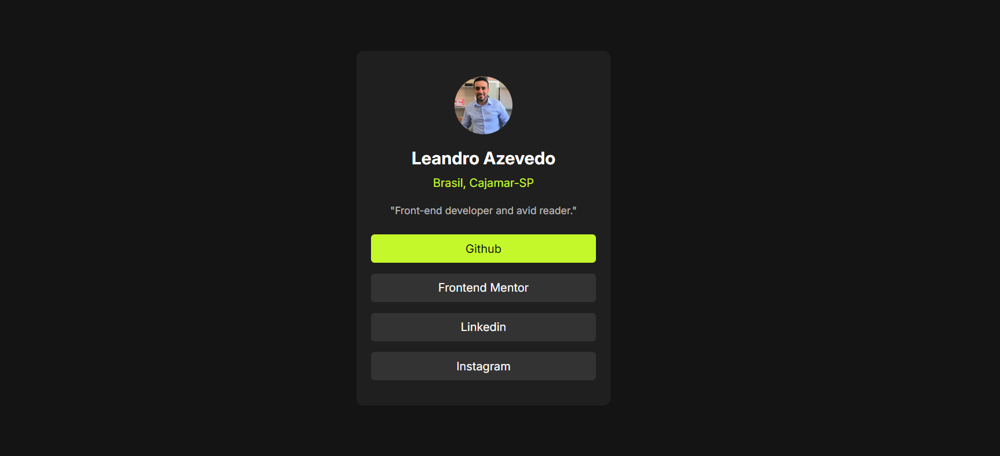

# Frontend Mentor - Blog Preview Card 📰

Este é um projeto desenvolvido como parte de um desafio do [Frontend Mentor](https://www.frontendmentor.io). O objetivo foi criar um componente de cartão para pré-visualização de blogs, utilizando apenas **HTML** e **CSS**, com design responsivo.

---

## 🎯 Objetivo do Projeto

Aprimorar e reforçar conceitos fundamentais em **HTML** e **CSS**, como estruturação semântica, estilização e responsividade. Mesmo em projetos simples, é sempre uma ótima oportunidade para praticar e evoluir habilidades.

---
## 🛠️ Tecnologias Utilizadas

<strong>HTML5</strong>: Para a estruturação da página e uso de tags semânticas.

<strong>CSS3</strong>: Para estilização, uso de Flexbox e aplicação de responsividade.

---

## 📚 Funcionalidades

- Design responsivo que se adapta a diferentes tamanhos de tela (dispositivos móveis, tablets e desktops).
- Layout estético e fiel ao design fornecido no desafio.

---
## 🖼️ Prévia

Acesse a página online: [Live Demo]().

---
📜 Licença

- Este projeto está licenciado sob a <strong>MIT License.</strong>
- O design foi baseado no desafio fornecido pelo Frontend Mentor, e foi personalizado com meus perfis sociais.

